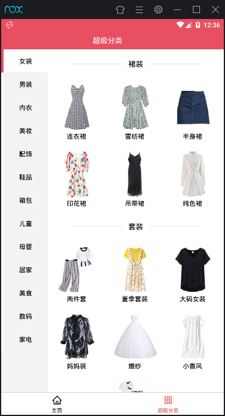
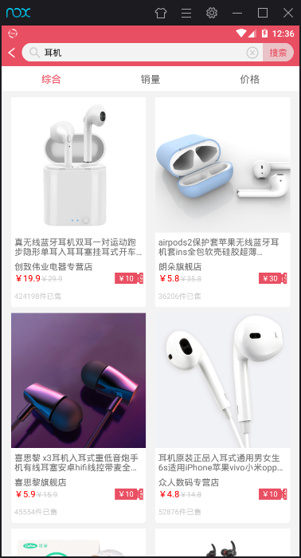
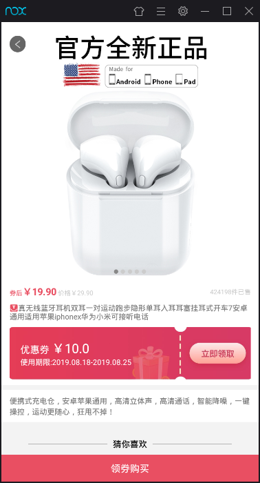
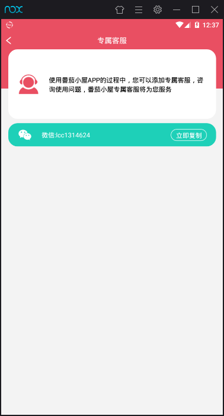

# TomatoHut

<a href="https://github.com/MX8CLUB/TomatoHut/releases"></a>
<a href="https://github.com/MX8CLUB/TomatoHut/stargazers"></a>
<a href="https://github.com/MX8CLUB/TomatoHut/network/members"></a>
<a href="https://github.com/MX8CLUB/TomatoHut/releases"></a>

番茄小屋React Native客户端V1.1.8

还有许多地方待完善，可自行完善，接入了腾讯Bugly，与React-Native中文网react-native-update热更新平台，使用请修改相关文件

## 目录

* [免责声明](#免责声明)
* [项目依赖](#项目依赖)
* [安装](#安装)
* [相关截图](#相关截图)
* [打赏](#打赏)

## 免责声明

**本项目仅供学习交流使用，不得用于其他商业行为，数据来源于第三方网站，与本人无关！**

接口采用[好单库](http://publish.haodanku.com/Reg/index.html?i=36521)，自己使用TP5包装了一下apikey，返回结果跟好单库保持一致

## 项目依赖
本项目采用第三方组件如下
- "@ant-design/react-native": "^3.1.12" 
- "react-native-alibaichuan": "github:MX8CLUB/react-native-alibaichuan",
- "react-native-bugly": "github:walkOnly/react-native-bugly",
- "react-native-gesture-handler": "^1.3.0",
- "react-native-smartrefreshlayout": "^0.6.7",
- "react-native-splash-screen": "^3.2.0",
- "react-native-update": "^5.1.8",
- "react-navigation": "^3.11.0",
- "react-redux": "^7.1.0",
- "redux": "^4.0.1",
- "redux-saga": "^1.0.5",
- "rn-fetch-blob": "^0.10.15"

## 安装

github [项目地址](https://github.com/MX8CLUB/TomatoHut)

本项目适用于相关技术人员学习交流，请自行编译安装

```sh
git clone https://github.com/MX8CLUB/TomatoHut.git

cd TomatoHut

yarn

react-native run-android
```

## 相关截图

### 首页


### 首页下篇


### 超级分类



### 分类列表


### 搜索页


### 搜索列表



### 商品详情



### 猜你喜欢


### 客服



## 打赏

精神支撑一下，给个 star 

如果体验觉得还不错的话，大佬们可以随意打赏，金额不限


